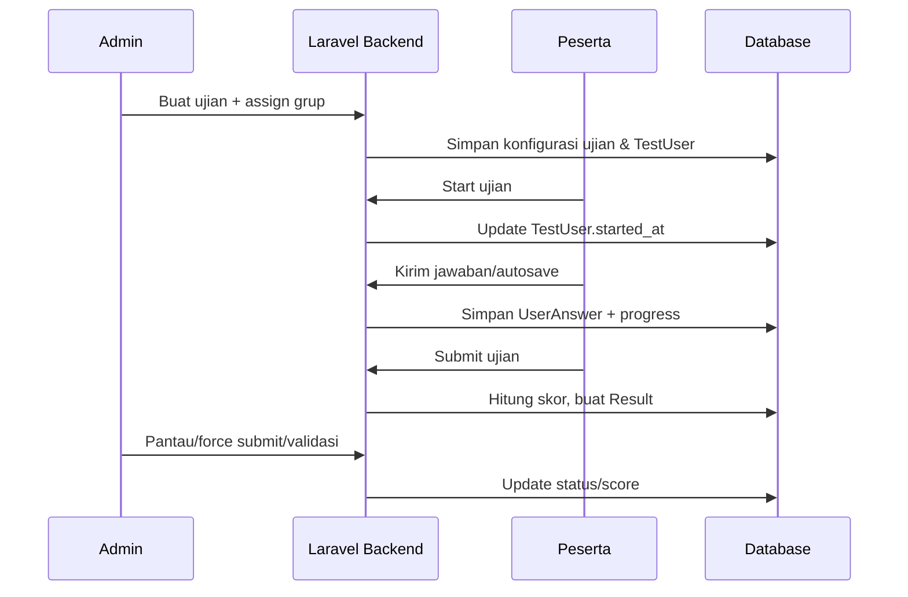

# Computer-Based-Test CBT Platform

> Platform Computer Based Test (CBT) untuk mengelola bank soal, jadwal ujian, peserta, serta pemantauan hasil secara realtime. Aplikasi dibangun dengan Laravel 10 + Inertia React + TailwindCSS agar admin maupun peserta mendapatkan pengalaman yang konsisten.

## Daftar Isi

1. [Gambaran Umum](#gambaran-umum)
2. [Fitur Utama](#fitur-utama)
3. [Stack Teknologi](#stack-teknologi)
4. [Arsitektur Sistem](#arsitektur-sistem)
5. [Flow Sistem](#flow-sistem)
6. [Model dan Relasi Data](#model-dan-relasi-data)
7. [Struktur Direktori Penting](#struktur-direktori-penting)
8. [Persiapan Lingkungan & Instalasi](#persiapan-lingkungan--instalasi)
9. [Workflow Pengembangan](#workflow-pengembangan)
10. [Pengujian & Kualitas](#pengujian--kualitas)
11. [Operasional Data (Import/Export)](#operasional-data-importexport)
12. [Monitoring, Statistik, & Analytics](#monitoring-statistik--analytics)
13. [Keamanan & Kepatuhan](#keamanan--kepatuhan)
14. [Checklist Rilis/Deploy](#checklist-rilisdeploy)
15. [Troubleshooting Cepat](#troubleshooting-cepat)
16. [Lisensi](#lisensi)

## Gambaran Umum

Computer-Based-Test memfasilitasi seluruh siklus CBT: mulai dari import peserta dan soal, menyusun modul-topik, merancang ujian, mengatur akses peserta, memantau pengerjaan secara realtime, sampai menilai serta mengekspor hasil. Rute admin berada di [routes/admin.php](routes/admin.php) sedangkan rute peserta berada di [routes/peserta.php](routes/peserta.php), keduanya diamankan oleh middleware otentikasi, aktivasi akun, dan validasi peran.

## Fitur Utama

- **Manajemen Pengguna & Kelompok** – CRUD pengguna, import massal, serta assignment grup/angkatan melalui `ImportUserController` dan `UserController`.
- **Bank Soal Terstruktur** – Modul → Topik → Soal + Jawaban (multiple choice / esai) dengan pengelompokan di [app/Models/Module.php](app/Models/Module.php), [app/Models/Topic.php](app/Models/Topic.php), [app/Models/Question.php](app/Models/Question.php), dan [app/Models/Answer.php](app/Models/Answer.php).
- **Desain Ujian Fleksibel** – Relasi ujian ↔ topik ↔ grup di [app/Models/Test.php](app/Models/Test.php) memungkinkan randomisasi soal/jawaban, pengaturan durasi, serta kontrol publikasi.
- **Penjadwalan & Kontrol Akses** – Middleware `active`, `role`, `single.session`, hingga `exam.state`/`exam.time` memastikan peserta hanya bisa mengerjakan ujian yang sah.
- **Monitoring Realtime** – Admin dapat melihat status peserta, melakukan force submit, lock/unlock, tambah waktu, hingga bulk action via `TestUserController`, `MonitoringController`, dan `ForceSubmitController`.
- **Autosave & Resume** – Peserta mengirim jawaban melalui endpoint `peserta.tests.answer`, progres disimpan di [app/Models/TestUser.php](app/Models/TestUser.php) sehingga dapat melanjutkan soal terakhir.
- **Analitik & Statistik** – Dashboard `AnalyticsController` dan `StatisticsController` menyediakan rekapan performa per ujian maupun per peserta, lengkap dengan validasi hasil esai `tests.grade-essay`.
- **Import/Export** – `maatwebsite/excel` menangani template import pengguna/soal serta ekspor `TestUser` atau hasil ujian. `barryvdh/laravel-dompdf` menyiapkan PDF raport.
- **Integrasi UI Modern** – Frontend React memakai Tailwind, Headless UI, Framer Motion, React Quill, KaTeX, Recharts, SweetAlert2 untuk pengalaman interaktif.

## Stack Teknologi

| Layer           | Teknologi                                                                                            | Catatan                                                |
| --------------- | ---------------------------------------------------------------------------------------------------- | ------------------------------------------------------ |
| Backend         | PHP 8.1, Laravel 10, Laravel Sanctum, Inertia Laravel, Laravel Breeze                                | REST + SSR hybrid via Inertia, otentikasi sesi & token |
| Frontend        | React 18, Vite 5/7, TailwindCSS 3, Headless UI, Framer Motion, React Quill, KaTeX, Recharts          | SPA ringan tanpa memisahkan repo                       |
| Paket Inti      | `maatwebsite/excel`, `barryvdh/laravel-dompdf`, `tightenco/ziggy`, `@heroicons/react`, `sweetalert2` | Import/export, PDF, sharing routes ke frontend, UI kit |
| Tools Dev       | Composer 2, Node.js ≥ 18, npm/pnpm, Laravel Pint, PHPUnit 10                                         | Penulisan kode dan QA                                  |
| Storage & Infra | MySQL/MariaDB, Redis optional (queue/cache), Local/Cloud storage untuk lampiran soal                 | Disesuaikan dengan `.env`                              |

## Arsitektur Sistem

Arsitektur mengikuti pola klasik Laravel namun diperkaya service layer domain CBT.

```mermaid
graph TD
	 A[Browser Admin/Peserta] -->|Inertia request| B[routes/web.php & routes/admin.php]
	 B --> C[Middleware Stack]
	 C --> D[Controllers]
	 D --> E[Services (Analytics/CBT/Statistics)]
	 E --> F[Models & Eloquent ORM]
	 F --> G[(Database)]
	 D --> H[Jobs/Events (opsional)]
	 F --> I[Storage (gambar soal, PDF, Excel)]
	 D --> J[Integrasi Eksternal
		  • Excel Import/Export
		  • DomPDF
		  • Sanctum API]
```

**Lapisan Utama**

- **Routing** – Rute admin/peserta terpisah, plus rute API ringan untuk sinkronisasi waktu (`/api/time`).
- **Middleware** – Validasi otentikasi, status aktif, role-based access, single session, hingga middleware ujian khusus (`seb`, `exam.time`, `test.access`, `prevent.retake`).
- **Controllers** – Dipisah per domain (Admin, Peserta). Admin menangani bank soal, monitoring, analytics. Peserta fokus pada dashboard, daftar ujian, pengerjaan.
- **Services** – Logika bisnis berat (statistik, evaluasi hasil) ditempatkan di `app/Services/*` agar controller tetap tipis.
- **Models** – Representasi entitas CBT dengan relasi Eloquent.
- **Frontend** – Inertia React menjalankan UI tunggal; Ziggy menyediakan helper route JS.

## Flow Sistem

### 1. Journey Admin

1. **Persiapan Pengguna** – Import template Excel (`/admin/users/import`), mapping kolom, kemudian assign ke grup melalui `users.assign-groups`.
2. **Penyusunan Materi** – Buat modul dan topik, upload soal (manual atau import). Randomisasi soal/jawaban diatur di pivot `test_topics` [app/Models/Test.php](app/Models/Test.php#L25-L45).
3. **Konfigurasi Ujian** – Tentukan durasi, jadwal, grup peserta, serta kebijakan hasil (`results_to_users`).
4. **Distribusi Peserta** – `TestUserController` men-generate relasi peserta↔ujian, termasuk status lock, penambahan waktu, dan bulk action.
5. **Monitoring Live** – Melalui dashboard monitoring/analytics admin dapat melihat: siapa yang sedang ujian, soal terakhir, progress, serta melakukan force submit.
6. **Penilaian & Validasi** – Sistem menghitung otomatis untuk pilihan ganda (field `is_correct` di [app/Models/UserAnswer.php](app/Models/UserAnswer.php)). Essay divalidasi lewat endpoint `tests.grade-essay`, dengan hasil tersimpan di [app/Models/Result.php](app/Models/Result.php).
7. **Analitik & Ekspor** – Statistik per ujian/peserta dapat diekspor Excel/PDF untuk laporan resmi.

### 2. Journey Peserta

1. **Login & Validasi Perangkat** – Middleware `single.session` memastikan hanya satu sesi aktif. Di production, middleware tambahan (`seb`, `exam.state`, dsb.) menegakkan aturan khusus ruang ujian.
2. **Dashboard & Jadwal** – Peserta melihat kartu ujian aktif di `/peserta/tests` lengkap dengan countdown.
3. **Start Ujian** – Endpoint `peserta.tests.start` membuat record `TestUser` (status `in_progress`).
4. **Pengerjaan & Autosave** – Setiap jawaban dikirim ke `peserta.tests.answer`, sistem menyimpan `current_index`, `last_question_id`, dan `last_activity_at` agar bisa resume.
5. **Submit** – Peserta submit via `peserta.tests.submit`. Setelah selesai, hasil dapat dicek di `/peserta/results` jika ujian mengizinkan publikasi.

### 3. Sequence Alur Ujian



## Model dan Relasi Data

| Entitas      | Fungsi                         | Relasi Kunci                                                     |
| ------------ | ------------------------------ | ---------------------------------------------------------------- |
| `Module`     | Kategori materi besar          | hasMany `Topic`                                                  |
| `Topic`      | Sub-materi yang menampung soal | belongsTo `Module`, hasMany `Question`, belongsToMany `Test`     |
| `Question`   | Soal PG/Essay                  | belongsTo `Topic`, hasMany `Answer` & `UserAnswer`               |
| `Answer`     | Opsi jawaban PG                | belongsTo `Question`                                             |
| `Group`      | Angkatan/kelas peserta         | belongsToMany `User` & `Test`                                    |
| `Test`       | Konfigurasi ujian              | belongsToMany `Topic`/`Group`, hasMany `TestUser`                |
| `TestUser`   | Status pengerjaan per peserta  | belongsTo `Test` & `User`, hasMany `UserAnswer`, hasOne `Result` |
| `UserAnswer` | Jawaban peserta per soal       | belongsTo `TestUser`, `Question`, dan `Answer`                   |
| `Result`     | Nilai akhir + validasi         | belongsTo `TestUser`, belongsTo `User` (validator)               |
| `User`       | Admin/peserta                  | belongsToMany `Group`, hasMany `TestUser`, `validatedResults`    |

## Struktur Direktori Penting

- [app/Http/Controllers/Admin](app/Http/Controllers/Admin) – Controller domain admin: import, bank soal, ujian, analytics.
- [app/Http/Controllers/Peserta](app/Http/Controllers/Peserta) – Controller khusus peserta (dashboard, ujian, hasil).
- [app/Services](app/Services) – Service class analitik/CBT/statistik untuk memisahkan logika kompleks.
- [app/Http/Middleware](app/Http/Middleware) – Middleware otentikasi tambahan (single session, exam state, dll.).
- [resources/js](resources/js) – UI React (komponen, halaman Inertia, hooks).
- [routes/admin.php](routes/admin.php) & [routes/peserta.php](routes/peserta.php) – Definisi rute utama dan middleware stack.
- [database/migrations](database/migrations) – Skema DB termasuk tabel pivot (`test_topics`, `test_groups`, `user_groups`).

## Persiapan Lingkungan & Instalasi

1. **Prasyarat**
    - PHP 8.1+, Composer 2+
    - Node.js 18+ (disarankan 20 LTS)
    - MySQL/MariaDB/PostgreSQL
    - Ekstensi PHP: `gd`, `fileinfo`, `mbstring`, `openssl`, `pdo`, `zip`
2. **Clone & Dependensi**
    ```bash
    git clone <repo-url>
    cd Computer-Based-Test
    composer install
    npm install
    ```
3. **Konfigurasi `.env`**
    - Copy `.env.example` → `.env`
    - Atur `APP_URL`, `APP_ENV`, `APP_DEBUG`
    - Set `DB_*`
    - Konfigurasi mail (untuk notifikasi) & storage jika perlu CDN/S3
    - Atur `SANCTUM_STATEFUL_DOMAINS` saat memakai domain khusus
4. **Key & Storage**
    ```bash
    php artisan key:generate
    php artisan storage:link
    ```
5. **Migrasi & Seeder**
    ```bash
    php artisan migrate --seed
    ```
6. **Bangun Asset**
    ```bash
    npm run dev      # pengembangan
    npm run build    # produksi
    ```

## Workflow Pengembangan

- Jalan backend: `php artisan serve` atau gunakan Valet/Laragon.
- Jalan frontend: `npm run dev` (Vite HMR).
- Gunakan `php artisan route:list --path=admin` untuk memeriksa rute admin saat menambah fitur baru.
- Terapkan Laravel Pint (`./vendor/bin/pint`) untuk menjaga gaya kode.
- Aktifkan queue worker bila memakai job asynchronous: `php artisan queue:work`.

## Pengujian & Kualitas

- **Feature/Unit Test** – Tambahkan test di [tests/Feature](tests/Feature) & [tests/Unit](tests/Unit). Jalankan `php artisan test` atau `./vendor/bin/phpunit`.
- **Linting** – `./vendor/bin/pint` (PHP) dan `npm run lint` (jika ditambahkan ESLint).
- **CI/CD** – Tambahkan workflow GitHub Actions untuk composer/npm install, test, dan build Vite.

## Operasional Data (Import/Export)

- Template import pengguna & soal tersedia melalui endpoint `/admin/users/import/template` dan `/admin/questions/import/template` memakai `maatwebsite/excel`.
- Upload file Excel via form import, sistem melakukan validasi, mapping, serta logging error per baris.
- Ekspor data peserta ujian di `/admin/export/test-users` dan gunakan `AnalyticsController` untuk laporan PDF.

## Monitoring, Statistik, & Analytics

- **Monitoring Live** – Lihat kartu status per peserta (progress bar, soal terakhir, timer) serta tombol lock/unlock/add time/force submit.
- **Analytics Dashboard** – `/admin/analytics` menampilkan metrik agregat: distribusi nilai, tingkat kesulitan soal, perbandingan antar grup.
- **Statistics Controller** – Endpoint `/admin/statistics/tests/{test}` dan `/admin/statistics/students/{user}` untuk drill-down performa.

## Keamanan & Kepatuhan

- Middleware `single.session` mencegah multi-login.
- Middleware ujian (`seb`, `exam.state`, `exam.time`, `test.access`, `prevent.retake`) dapat diaktifkan selektif sesuai environment agar fleksibel saat staging.
- Gunakan HTTPS + konfigurasi `SESSION_DOMAIN`/`SANCTUM_STATEFUL_DOMAINS` saat deploy multi-domain.
- Simpan kredensial `.env` dengan aman dan manfaatkan `php artisan config:cache` saat produksi.

## Checklist Rilis/Deploy

1. `composer install --no-dev` & `npm ci && npm run build`
2. `php artisan migrate --force`
3. `php artisan config:cache && php artisan route:cache && php artisan view:cache`
4. Pastikan `APP_DEBUG=false`, `LOG_LEVEL=info`
5. Setup supervisor/pm2 untuk queue worker & Vite SSR (jika diperlukan)
6. Uji endpoint kritis (login, start ujian, submit, export)

## Troubleshooting Cepat

- **Login loop** – Pastikan `APP_URL`, `SESSION_DOMAIN`, dan cookie sanctum sinkron.
- **Import Excel gagal** – Cek extension `php_zip` & `php_xml`, serta validasi kolom sesuai template.
- **Timer tidak bergerak** – Periksa timezone server serta endpoint `/api/time` (tanpa middleware Inertia, lihat [routes/web.php](routes/web.php#L31-L44)).
- **Asset tidak ter-load** – Jalankan `npm run build` lalu `php artisan view:clear`.


